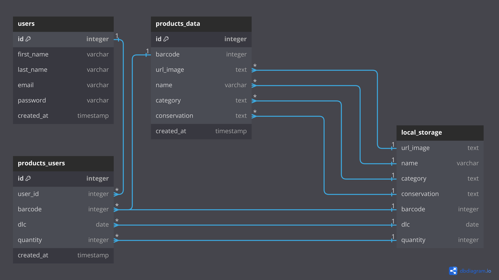

# Technical Specifications/Specifications Techniques

📖 Table of content

- [Technical Specifications/Specifications Techniques](#technical-specificationsspecifications-techniques)
  - [English](#english)
  - [Français](#français)
    - [Introduction](#introduction)
    - [Base de données](#base-de-données)

## English

## Français

### Introduction

D'abord pensé pour être une application Flutter, Périm'App a finalement été développée via la Power Platform de Microsoft pour un développement simple et rapide, puis en Kotlin pour la version Android, et pour finir, en Swift pour la version iOS.

### Base de données

Schéma de notre système de base de données

