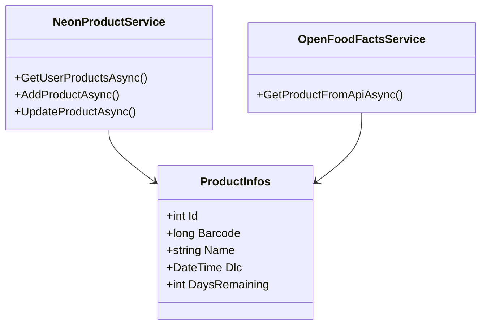

# Spécifications Techniques - Perim'APP

**Version :** 1.0  
**Date :** Décembre 2024  
**Projet :** Application mobile de gestion des dates de péremption  

---

## 📋 Table des matières

1. [Architecture générale](#architecture-générale)
2. [Stack technique](#stack-technique)
3. [Architecture de l'application](#architecture-de-lapplication)
4. [Base de données](#base-de-données)
5. [APIs et services externes](#apis-et-services-externes)
6. [Sécurité](#sécurité)
7. [Déploiement et infrastructure](#déploiement-et-infrastructure)
8. [Environnement de développement](#environnement-de-développement)
9. [Tests et qualité](#tests-et-qualité)
10. [Performance et monitoring](#performance-et-monitoring)

---

## 1. Architecture générale

### 1.1 Vue d'ensemble

Perim'APP est une application mobile cross-platform développée avec .NET MAUI, suivant une architecture en couches avec séparation des responsabilités.

```
┌─────────────────────────────────────────┐
│              Presentation               │
│         (.NET MAUI - XAML/C#)          │
├─────────────────────────────────────────┤
│              Business Logic             │
│         (Services, ViewModels)          │
├─────────────────────────────────────────┤
│              Data Access                │
│        (Repositories, Services)         │
├─────────────────────────────────────────┤
│              Infrastructure             │
│      (Database, External APIs)          │
└─────────────────────────────────────────┘
```

### 1.2 Principes architecturaux

- **MVVM Pattern :** Séparation claire entre Vue, ViewModel et Modèle
- **Dependency Injection :** Gestion des dépendances via le container .NET
- **Single Responsibility :** Chaque classe a une responsabilité unique
- **Separation of Concerns :** Séparation logique entre les couches

---

## 2. Stack technique

### 2.1 Technologies principales

| Composant | Technologie | Version | Usage |
|-----------|-------------|---------|-------|
| **Framework** | .NET MAUI | 9.0 | Framework multiplateforme |
| **Language** | C# | 12.0 | Langage de développement |
| **UI** | XAML | - | Interface utilisateur |
| **Base de données** | PostgreSQL | 15+ | Stockage des données |
| **ORM** | Npgsql | 8.0+ | Accès aux données |
| **Cloud DB** | Neon.tech | - | Hébergement PostgreSQL |

### 2.2 Bibliothèques et packages

```xml
<!-- Packages NuGet principaux -->
<PackageReference Include="Npgsql" Version="8.0.0" />
<PackageReference Include="System.Text.Json" Version="8.0.0" />
<PackageReference Include="Microsoft.Extensions.Logging" Version="8.0.0" />
<PackageReference Include="CommunityToolkit.Mvvm" Version="8.2.0" />
```

### 2.3 Plateformes cibles

- **Android** : API level 21+ (Android 5.0)
- **iOS** : iOS 11.0+
- **Windows** : Windows 10 version 1809+
- **macOS** : macOS 10.15+

---

## 3. Architecture de l'application

### 3.1 Structure des projets

```
perimapp.sln
├── perimapp/                    # Projet principal MAUI
│   ├── Platforms/              # Code spécifique aux plateformes
│   ├── Pages/                  # Pages XAML
│   ├── Resources/              # Ressources (images, styles)
│   └── ViewModels/             # ViewModels MVVM
├── PerimApp.Core/              # Logique métier partagée
│   ├── Models/                 # Modèles de données
│   ├── Services/               # Services métier
│   └── Utilities/              # Utilitaires
└── PerimApp.Tests/             # Tests unitaires
```

### 3.2 Modèles de données principaux

#### ProductInfos
```csharp
public class ProductInfos
{
    public int Id { get; set; }
    public long Barcode { get; set; }
    public string Name { get; set; }
    public string UrlImage { get; set; }
    public string Category { get; set; }
    public string Conservation { get; set; }
    public DateTime AddedAt { get; set; }
    public DateTime Dlc { get; set; }
    public int Quantity { get; set; }
    
    // Propriétés calculées
    public int DaysRemaining { get; }
    public string DaysRemainingTextMainPage { get; }
    public string DaysRemainingTextDetailsPage { get; }
}
```

#### UserProfileDetails
```csharp
public class UserProfileDetails
{
    public string FirstName { get; set; }
    public string LastName { get; set; }
    public string Email { get; set; }
    public string Password { get; set; }
    public int HomeCode { get; set; }
    public string LostProducts { get; set; }
    public int RegisteredProductsCount { get; set; }
}
```

### 3.3 Services principaux

#### NeonProductService
- **Responsabilité :** Gestion des produits en base de données
- **Méthodes principales :**
  - `GetUserProductsAsync(int userId)`
  - `AddProductAsync(ProductInfos product)`
  - `UpdateProductAsync(ProductInfos product)`
  - `DeleteProductAsync(int productId)`

#### OpenFoodFactsService
- **Responsabilité :** Intégration avec l'API OpenFoodFacts
- **Méthodes principales :**
  - `GetProductFromApiAsync(long barcode)`
- **Endpoint :** `https://world.openfoodfacts.net/api/v2/product/{barcode}.json`

#### NeonUserService
- **Responsabilité :** Gestion des utilisateurs
- **Méthodes principales :**
  - `AuthenticateUserAsync(string email, string password)`
  - `RegisterUserAsync(UserProfileDetails user)`
  - `GetUserProfileAsync(int userId)`

### 3.4 Pattern MVVM

```csharp
// Exemple de ViewModel
public class MainPageViewModel : ObservableObject
{
    private readonly NeonProductService _productService;
    private ObservableCollection<ProductInfos> _products;
    
    public MainPageViewModel(NeonProductService productService)
    {
        _productService = productService;
        LoadProductsCommand = new AsyncRelayCommand(LoadProducts);
    }
    
    public IAsyncRelayCommand LoadProductsCommand { get; }
    
    private async Task LoadProducts()
    {
        var products = await _productService.GetUserProductsAsync(currentUserId);
        Products = new ObservableCollection<ProductInfos>(products);
    }
}
```

---

## 4. Base de données

### 4.1 Architecture de la base de données

**Provider :** Neon.tech (PostgreSQL as a Service)  
**Connexion :** Pool de connexions sécurisé avec SSL

```
Host: ep-little-bread-abqvwscs-pooler.eu-west-2.aws.neon.tech
Database: perimapp
SSL Mode: Required
```

### 4.2 Schéma de base de données

#### Table : users
```sql
CREATE TABLE users (
    id SERIAL PRIMARY KEY,
    first_name VARCHAR(100) NOT NULL,
    last_name VARCHAR(100) NOT NULL,
    email VARCHAR(255) UNIQUE NOT NULL,
    password_hash VARCHAR(255) NOT NULL,
    home_code INTEGER,
    lost_products TEXT,
    created_at TIMESTAMP DEFAULT CURRENT_TIMESTAMP
);
```

#### Table : products_data
```sql
CREATE TABLE products_data (
    barcode BIGINT PRIMARY KEY,
    name VARCHAR(255) NOT NULL,
    url_image TEXT,
    category VARCHAR(100),
    conservation VARCHAR(50),
    created_at TIMESTAMP DEFAULT CURRENT_TIMESTAMP
);
```

#### Table : products_users
```sql
CREATE TABLE products_users (
    id SERIAL PRIMARY KEY,
    user_id INTEGER REFERENCES users(id),
    barcode BIGINT REFERENCES products_data(barcode),
    dlc DATE NOT NULL,
    quantity INTEGER DEFAULT 1,
    added_at TIMESTAMP DEFAULT CURRENT_TIMESTAMP
);
```

### 4.3 Index et optimisations

```sql
-- Index pour améliorer les performances
CREATE INDEX idx_products_users_user_id ON products_users(user_id);
CREATE INDEX idx_products_users_dlc ON products_users(dlc);
CREATE INDEX idx_users_email ON users(email);
CREATE INDEX idx_users_home_code ON users(home_code);
```

---

## 5. APIs et services externes

### 5.1 OpenFoodFacts API

**Base URL :** `https://world.openfoodfacts.net/api/v2/`

#### Endpoint produit
```http
GET /product/{barcode}.json
```

**Réponse exemple :**
```json
{
  "product": {
    "product_name": "Coca-Cola",
    "image_url": "https://...",
    "categories": "Sodas",
    "...": "..."
  },
  "status": 1,
  "status_verbose": "product found"
}
```

### 5.2 Gestion des erreurs API

```csharp
public async Task<ProductInfos?> GetProductFromApiAsync(long barcode)
{
    try
    {
        var response = await _httpClient.GetFromJsonAsync<JsonDocument>(url);
        // Traitement de la réponse
        return product;
    }
    catch (HttpRequestException ex)
    {
        _logger.LogError(ex, "Erreur lors de l'appel API OpenFoodFacts");
        return null;
    }
    catch (JsonException ex)
    {
        _logger.LogError(ex, "Erreur de parsing JSON OpenFoodFacts");
        return null;
    }
}
```

---

## 6. Sécurité

### 6.1 Authentification

- **Méthode :** Email/Mot de passe
- **Hachage :** BCrypt pour les mots de passe
- **Session :** Gestion locale de l'état de connexion

```csharp
public class PasswordHasher
{
    public string HashPassword(string password)
    {
        return BCrypt.Net.BCrypt.HashPassword(password);
    }
    
    public bool VerifyPassword(string password, string hash)
    {
        return BCrypt.Net.BCrypt.Verify(password, hash);
    }
}
```

### 6.2 Sécurité des données

- **Chiffrement en transit :** SSL/TLS pour toutes les communications
- **Chiffrement au repos :** Fourni par Neon.tech (PostgreSQL)
- **Validation des entrées :** Validation côté client et serveur
- **Injection SQL :** Protection via paramètres Npgsql

### 6.3 Gestion des secrets

```csharp
// Configuration sécurisée
private const string ConnectionString = 
    "Host=...;Username=...;Password=...;SSL Mode=Require;Trust Server Certificate=true";
```

**À améliorer :** Utilisation de Key Vault ou variables d'environnement

---

## 7. Déploiement et infrastructure

### 7.1 Architecture de déploiement

```
┌─────────────────┐    ┌─────────────────┐    ┌─────────────────┐
│   App Stores    │    │   Direct APK    │    │   Development   │
│   (Production)  │    │   (Staging)     │    │   (Local)       │
└─────────────────┘    └─────────────────┘    └─────────────────┘
         │                       │                       │
         └───────────────────────┼───────────────────────┘
                                 │
                    ┌─────────────────┐
                    │   Neon.tech     │
                    │   PostgreSQL    │
                    │   (Cloud)       │
                    └─────────────────┘
```

### 7.2 Configuration Docker

```dockerfile
FROM mcr.microsoft.com/dotnet/sdk:9.0 AS build
WORKDIR /src
COPY ["perimapp/perimapp.csproj", "perimapp/"]
RUN dotnet restore "perimapp/perimapp.csproj"

COPY . .
WORKDIR "/src/perimapp"
RUN dotnet build "perimapp.csproj" -c Release -o /app/build

FROM build AS publish
RUN dotnet publish "perimapp.csproj" -c Release -o /app/publish

FROM mcr.microsoft.com/dotnet/aspnet:9.0 AS final
WORKDIR /app
COPY --from=publish /app/publish .
EXPOSE 5000
ENTRYPOINT ["dotnet", "perimapp.dll"]
```

### 7.3 CI/CD Pipeline (Proposé)

```yaml
# .github/workflows/ci-cd.yml
name: CI/CD Pipeline
on:
  push:
    branches: [main, develop]
  pull_request:
    branches: [main]

jobs:
  build:
    runs-on: ubuntu-latest
    steps:
      - uses: actions/checkout@v4
      - name: Setup .NET
        uses: actions/setup-dotnet@v3
        with:
          dotnet-version: '9.0.x'
      - name: Restore dependencies
        run: dotnet restore
      - name: Build
        run: dotnet build --no-restore
      - name: Test
        run: dotnet test --no-build --verbosity normal
```

---

## 8. Environnement de développement

### 8.1 Prérequis

- **.NET 9 SDK** (version LTS)
- **Visual Studio 2022** avec workload .NET MAUI
- **JetBrains Rider** (alternative)
- **Git** pour le contrôle de version

### 8.2 Configuration de développement

```bash
# Installation du projet
git clone https://github.com/AJA-Corp/perim_app.git
cd perim_app

# Restauration des packages
dotnet restore

# Build du projet
dotnet build

# Lancement de l'application (si console app)
dotnet run --project perimapp
```

### 8.3 Structure des branches

- **main** : Branche de production
- **develop** : Branche de développement
- **feature/*** : Branches de fonctionnalités
- **bugfix/*** : Branches de correction de bugs
- **hotfix/*** : Corrections urgentes en production

### 8.4 Standards de développement

#### Conventions de nommage
```csharp
// Classes : PascalCase
public class ProductService { }

// Méthodes : PascalCase
public async Task<Product> GetProductAsync() { }

// Variables : camelCase
private readonly string connectionString;

// Constantes : PascalCase
private const string DefaultCategory = "Other";
```

#### Structure des commits
```
type(scope): description

feat(product): add barcode scanning functionality
fix(auth): resolve login validation issue
docs(readme): update installation instructions
```

---

## 9. Tests et qualité

### 9.1 Stratégie de test

```
Tests Unitaires (70%)
├── Services
├── ViewModels  
└── Utilities

Tests d'Intégration (20%)
├── Database Access
└── API Calls

Tests UI/E2E (10%)
├── Navigation
└── User Workflows
```

### 9.2 Framework de test

- **MSTest** ou **xUnit** pour les tests unitaires
- **Moq** pour les mocks
- **FluentAssertions** pour les assertions

```csharp
[TestMethod]
public async Task GetProductFromApiAsync_ValidBarcode_ReturnsProduct()
{
    // Arrange
    var service = new OpenFoodFactsService();
    var barcode = 3017620422003L; // Nutella

    // Act
    var result = await service.GetProductFromApiAsync(barcode);

    // Assert
    Assert.IsNotNull(result);
    Assert.AreEqual(barcode, result.Barcode);
}
```

### 9.3 Métriques de qualité

- **Couverture de code :** > 80%
- **Complexité cyclomatique :** < 10 par méthode
- **Code smells :** 0 (SonarQube)
- **Duplications :** < 3%

---

## 10. Performance et monitoring

### 10.1 Optimisations performance

#### Base de données
- **Connection pooling** : Réutilisation des connexions
- **Index appropriés** : Optimisation des requêtes
- **Pagination** : Limitation des résultats

#### Application
- **Lazy loading** : Chargement à la demande
- **Caching** : Mise en cache des données statiques
- **Async/Await** : Programmation asynchrone

### 10.2 Monitoring (À implémenter)

```csharp
// Logging structuré
_logger.LogInformation("User {UserId} added product {ProductName}", 
    userId, product.Name);

// Métriques personnalisées
_telemetry.TrackEvent("ProductAdded", new Dictionary<string, string>
{
    ["UserId"] = userId.ToString(),
    ["Category"] = product.Category
});
```

### 10.3 Alerting et monitoring

- **Application Insights** : Monitoring des performances
- **Health checks** : Vérification de l'état de l'application
- **Logs centralisés** : Agrégation des logs
- **Métriques métier** : Suivi des KPIs

---

## 📊 Annexes

### Diagramme de classes (simplifié)



### Contact technique

**Équipe de développement :** AJA-Corp  
**Architecture :** [Lead Architect]  
**Dernière mise à jour :** Décembre 2024